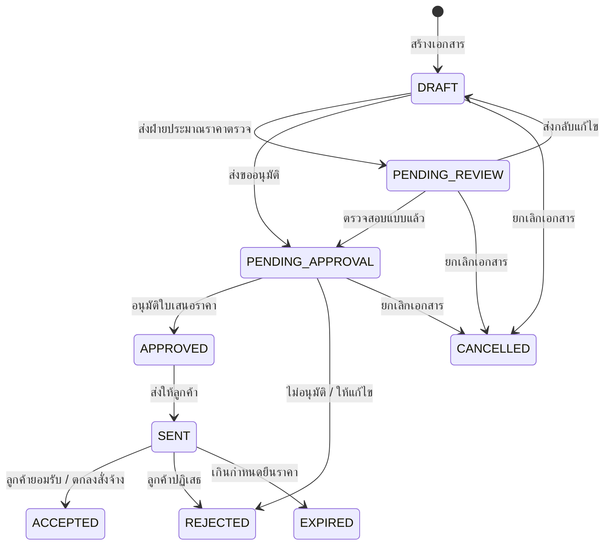

# กฎทางธุรกิจและการคำนวณ (Business Rules & Calculations)

อ้างอิงตามข้อกำหนดใน `PROJECT.md` เอกสารฉบับนี้กำหนดกฎเกณฑ์ทางธุรกิจ สูตรการคำนวณทางการเงิน วงจรสถานะของเอกสาร และมาตรฐานการจัดทำใบเสนอราคาสำหรับ SGQ Smart Glass Quality

---

## 1. การกำหนดเลขที่เอกสาร (Quotation Numbering Convention)

- เลขที่ใบเสนอราคาต้องสร้างขึ้นโดยอัตโนมัติในรูปแบบ:
  ```text
  QT-YYYY-XXXX
  ```
  - `QT` = คำนำหน้าเอกสาร Quotation
  - `YYYY` = ปี ค.ศ. ที่ออกเอกสาร เช่น `2026`
  - `XXXX` = เลขลำดับ 4 หลัก รันเรียงจาก `0001` ถึง `9999` ต่อปี
  - *ตัวอย่าง*: `QT-2026-0001`, `QT-2026-0002`
- หากผู้ใช้ระบุเลขที่เอกสารเอง ต้องมีอักขระตั้งแต่ 3 ถึง 32 ตัวอักษร ประกอบด้วยตัวอักษรภาษาอังกฤษ ตัวเลข และเครื่องหมาย `_ . -` เท่านั้น และต้องไม่ซ้ำกับเอกสารอื่นในระบบ

---

## 2. หลักการ Snapshot ข้อมูล (Price & Data Snapshot Principle)

> [!IMPORTANT]
> กฎสำคัญจาก `PROJECT.md`: *"ใบเสนอราคาต้องเก็บค่าราคาและข้อมูลรายการ ณ เวลาที่ออกเอกสาร เพื่อไม่ให้ข้อมูลเดิมเปลี่ยนตามราคาสินค้าปัจจุบัน"*

1. **Snapshot รายการสินค้า (`quotation_items`)**:
   - เมื่อเลือกสินค้าจากคลังสินค้า (`products`) ข้อมูล `itemName`, `unit`, `unitCost` (ต้นทุนต่อหน่วย ณ เวลานั้น) และ `unitPrice` (ราคาขายมาตรฐาน ณ เวลานั้น) จะถูกคัดลอกลงในตาราง `quotation_items` ทันที
   - หากในอนาคตมีการปรับราคาขายหรือราคาต้นทุนของสินค้าในตาราง `products` ข้อมูลในใบเสนอราคาที่ออกไปแล้วจะต้องไม่ได้รับผลกระทบใดๆ ทั้งสิ้น
2. **Snapshot ข้อมูลลูกค้า (`quotations`)**:
   - บันทึก `customerName`, `customerAddress`, `customerPhone`, `customerTaxId`, และ `customerContact` ณ เวลาที่ออกเอกสารไว้ในตาราง `quotations`
   - หากข้อมูลลูกค้าในตาราง `customers` มีการเปลี่ยนแปลงในภายหลัง เอกสารใบเสนอราคาเดิมจะยังคงแสดงข้อมูลตรงตามวันที่ออกเอกสารจริง
3. **Snapshot ข้อมูลโครงการ**:
   - บันทึก `projectName` ไว้ในใบเสนอราคา เพื่อให้สามารถอ้างอิงชื่องานได้แม้งานโครงการจะถูกแก้ไขในภายหลัง

---

## 3. สูตรการคำนวณทางการเงิน (Financial Calculation Formulas)

การคำนวณในใบเสนอราคาต้องเป็นไปตามมาตรฐานการค้าและภาษีมูลค่าเพิ่มของประเทศไทย (THB ทศนิยม 2 ตำแหน่ง พร้อมปัดเศษตามหลักคณิตศาสตร์ `Round Half Up`):

### 3.1 ยอดรวมต่อรายการ (Line Item Total)
```text
lineTotal = Math.max(0, (quantity × unitPrice) - discountAmount)
```
- `quantity`: ปริมาณสินค้า/บริการ (ต้องมากกว่า 0)
- `unitPrice`: ราคาจำหน่ายต่อหน่วย (บาท, ต้องไม่ต่ำกว่า 0)
- `discountAmount`: ส่วนลดเฉพาะรายการ (บาท, ต้องไม่ต่ำกว่า 0)

### 3.2 ยอดรวมก่อนส่วนลด (Subtotal)
```text
subtotal = ∑(lineTotal ของทุกรายการในใบเสนอราคา)
```

### 3.3 ส่วนลดรวม (Total Discount)
ระบบรองรับส่วนลดรวม 2 รูปแบบ:
1. **แบบจำนวนเงินคงที่ (`AMOUNT`)**:
   ```text
   discountAmount = Math.min(subtotal, Math.max(0, discountRate))
   ```
2. **แบบเปอร์เซ็นต์ (`PERCENT`)**:
   ```text
   discountAmount = round((subtotal × discountRate) / 100, 2)
   ```

### 3.4 ยอดรวมหลังหักส่วนลด (Total After Discount)
```text
totalAfterDiscount = Math.max(0, subtotal - discountAmount)
```

### 3.5 ภาษีมูลค่าเพิ่ม (Value Added Tax - VAT 7%)
ระบบใช้อัตราภาษีมูลค่าเพิ่มมาตรฐาน 7.00% (หรือ 0% สำหรับกรณีลูกค้ายกเว้นภาษี):
```text
vatAmount = round((totalAfterDiscount × vatRate) / 100, 2)
```

### 3.6 ยอดสุทธิรวมภาษีทั้งสิ้น (Grand Total)
```text
grandTotal = totalAfterDiscount + vatAmount
```

### 3.7 การแปลงจำนวนเงินเป็นตัวอักษรไทย (Thai Baht Text)
- เอกสารใบเสนอราคาต้องแสดงจำนวนเงินสุทธิเป็นตัวอักษรภาษาไทยอย่างเป็นทางการกำกับเสมอ เช่น `(หนึ่งแสนหนึ่งหมื่นสองพันสามร้อยห้าสิบบาทถ้วน)` เพื่อป้องกันการแก้ไขหรือเข้าใจผิดในยอดเงิน

### 3.8 การคำนวณต้นทุนและอัตรากำไรภายใน (Internal Margin & Costing)
ใช้สำหรับฝ่ายขายและฝ่ายประมาณราคาในการวิเคราะห์กำไร:
```text
totalCost = ∑(quantity × unitCost)
estimatedProfit = totalAfterDiscount - totalCost
profitMarginPercent = totalAfterDiscount > 0 ? round((estimatedProfit / totalAfterDiscount) × 100, 2) : 0
```

---

## 4. วงจรสถานะของใบเสนอราคา (Quotation Lifecycle & Transitions)



| สถานะ (Status) | ชื่อภาษาไทย | คำอธิบายและความหมาย | การกระทำที่ทำได้ |
|---|---|---|---|
| `DRAFT` | แบบร่าง | เอกสารกำลังอยู่ระหว่างการจัดทำ ยังไม่มีผลผูกพัน | แก้ไขได้ทุกส่วน, ลบได้, ส่งขออนุมัติ |
| `PENDING_REVIEW` | รอตรวจสอบ | ฝ่ายขายส่งให้ฝ่ายประมาณราคาถอดแบบและตรวจต้นทุน | ตรวจสอบราคา, ปรับปรุงรายการวัสดุ, ส่งต่อขออนุมัติ |
| `PENDING_APPROVAL` | รออนุมัติ | รอผู้มีอำนาจลงนาม / ผู้จัดการอนุมัติเอกสาร | อนุมัติ (`APPROVED`), ปฏิเสธ (`REJECTED`) |
| `APPROVED` | อนุมัติแล้ว | เอกสารได้รับการอนุมัติภายในแล้ว พร้อมส่งให้ลูกค้า | พิมพ์ PDF, ส่งให้ลูกค้า (`SENT`) |
| `SENT` | ส่งลูกค้าแล้ว | ส่งเอกสารให้ลูกค้าพิจารณาแล้ว อยู่ระหว่างรอผลตอบรับ | ลูกค้ายอมรับ (`ACCEPTED`), ปฏิเสธ (`REJECTED`) |
| `ACCEPTED` | ลูกค้ายอมรับ | ลูกค้าเซ็นอนุมัติหรือยืนยันสั่งซื้อ/สั่งจ้าง | ส่งต่องานเปิดใบสั่งผลิต / ดำเนินการติดตั้ง |
| `REJECTED` | ลูกค้าปฏิเสธ | ลูกค้าปฏิเสธข้อเสนอ (ระบุเหตุผลประกอบ) | บันทึกเหตุผล, ปิดการขาย |
| `EXPIRED` | หมดอายุ | เกินกำหนดยืนราคา (`validUntil`) | ทบทวนราคาใหม่, ออกใบเสนอราคาฉบับใหม่ |
| `CANCELLED` | ยกเลิกแล้ว | เอกสารถูกยกเลิกโดยผู้ใช้งาน | เก็บประวัติเพื่อการตรวจสอบ |

---

## 5. กฎการออกแบบหน้าจอผู้ใช้งาน (UI/UX Principles)

1. **ไม่ใช้ Modal Dialog ที่ไม่จำเป็น**:
   - การสร้างใบเสนอราคา (Create), การแก้ไขใบเสนอราคา (Edit), และการดูรายละเอียดเอกสาร (Detail/Print) ต้องแสดงผลเป็น **หน้าจอเต็ม (Full-Page View)**
   - ห้ามใช้ Pop-up Dialog สำหรับการกรอกแบบฟอร์มที่มีรายการสินค้าและการคำนวณที่ซับซ้อน
   - Modal Dialog อนุญาตให้ใช้เฉพาะการยืนยันการกระทำที่มีผลร้ายแรง (Destructive Confirmation เช่น การลบเอกสาร) เท่านั้น
2. **ขนาดตัวอักษรขั้นต่ำของระบบ**:
   - ขนาดตัวอักษรที่เล็กที่สุดในระบบต้องไม่ต่ำกว่า `text-xs` (12px)
   - ห้ามใช้ `text-[10px]` หรือ `text-[11px]` ในทุกกรณี
3. **การพิมพ์เอกสาร (Print & PDF Layout)**:
   - หน้ารายละเอียดใบเสนอราคาต้องจัดรูปแบบขนาดกระดาษ A4 มาตรฐาน
   - ซ่อนส่วนควบคุมการทำงาน ปุ่ม และเมนู เมื่อสั่งพิมพ์ (`@media print`)
   - แสดงหัวกระดาษบริษัท ข้อมูลลูกค้า รายการสินค้า การสรุปยอดเงินภาษาไทย และช่องลงนาม 3 ส่วน (ผู้จัดทำ, ผู้อนุมัติ, ลูกค้ายอมรับ) อย่างครบถ้วน

---

## 6. กฎการแสดงผลหน้าภาพรวมระบบ (Dashboard Overview & Time Period Filters)

1. **แหล่งข้อมูลจริง (Real Data Source)**:
   - หน้าภาพรวม (`/home?view=overview`) ต้องดึงข้อมูลสถิติจริงจากฐานข้อมูล (Quotations, Customers, Projects, Products)
   - ห้ามใช้ Mock Data หรือตัวเลขจำลอง
2. **ตัวกรองช่วงเวลา (Time Period Filter)**:
   - ตัวเลือกเริ่มต้น (Default): **วันนี้ (`TODAY`)**
   - ตัวเลือกที่รองรับ:
     - วันนี้ (`TODAY`)
     - เมื่อวาน (`YESTERDAY`)
     - สัปดาห์นี้ (`THIS_WEEK` - เริ่มวันจันทร์ ถึงวันอาทิตย์)
     - 7 วันล่าสุด (`LAST_7_DAYS`)
     - เดือนนี้ (`THIS_MONTH`)
     - ไตรมาสนี้ (`THIS_QUARTER`)
     - ปีนี้ (`THIS_YEAR`)
3. **การคำนวณเขตเวลา (Timezone Handling)**:
   - การแบ่งช่วงวัน เดือน ปี และเวลา ให้ใช้เวลาประเทศไทย (Asia/Bangkok, UTC+7) เป็นเกณฑ์
4. **การแสดงผลเลขที่เอกสารในตารางรายการล่าสุด**:
   - เลขที่ใบเสนอราคาแสดงแบบข้อความสีเขียว Monospace ไม่มี Badge (`font-mono text-xs sm:text-sm font-medium text-primary hover:underline cursor-pointer`) เหมือนกับตารางอื่นๆ ในระบบ